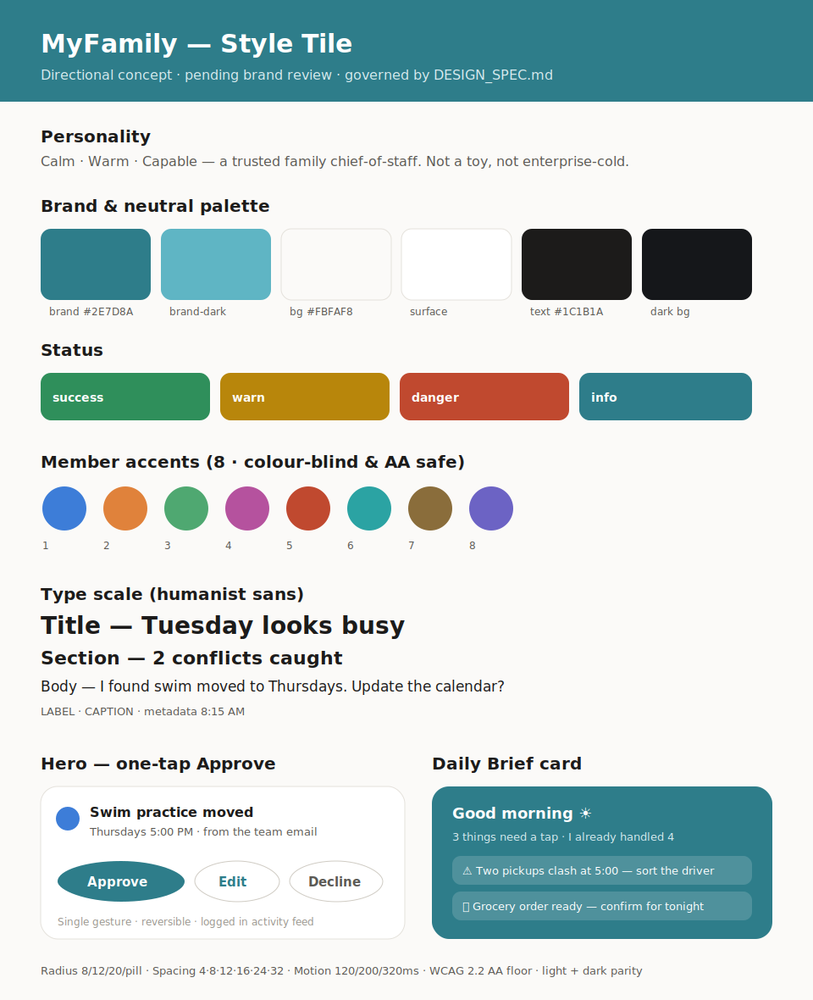

# MyFamily — Design Specification (UI/UX & Graphic Design Standards)

> **Authority:** This is a binding standard, not inspiration. Every screen, component, and
> asset in MyFamily must adhere to it. Where this document specifies a rule, the build
> follows it; deviations require explicit design-lead sign-off recorded in the PR.
>
> **Companion to:** [`SPEC.md`](./SPEC.md) (product & features). This document covers *how it
> looks, feels, and behaves.*

**Status:** Draft for review · **Scope:** Visual identity, design system, interaction/motion,
accessibility, content, adaptive/platform, age-appropriate UI · **Platform:** Mobile-first,
cross-platform (iOS + Android primary; companion web; widget / watch / voice / Family-Display
surfaces).

> **On concrete values:** Specific colors, fonts, and sizes below are marked **_(proposed —
> pending brand review)_**. They are production-ready defaults so the team can start, not final
> brand decree. The **token architecture, rules, and acceptance criteria are binding** even if
> a value changes.

---

## 1. Design vision & principles

MyFamily's product promise is **"calm software that quietly carries the mental load."** Design
is where that promise is kept or broken. A proactive, agentic app that feels cluttered, noisy,
or untrustworthy fails on contact. These six principles are design law; every later rule and
acceptance criterion traces back to one of them.

1. **Calm by default.** The job is to *remove* cognitive load, so the interface removes itself
   too. Reduce, don't add. One clear next action beats ten options. Whitespace is a feature.
2. **Glanceable.** A user — often one-handed, mid-chaos — must get value in **under 3 seconds**.
   Prioritize a single legible answer over dense dashboards.
3. **One tap to act.** Approvals are the **hero interaction** of the whole app. Acting on a
   suggestion is always a single, confident, reversible gesture — never a form.
4. **Quietly confident.** The app is doing real work on the family's behalf. Show that work
   transparently and reassuringly — never anxiously. No red-badge guilt, no nagging.
5. **Warm, not childish.** It must feel trustworthy with health, money, and children while
   staying human and warm. Not a toy; not enterprise-cold. Friendly competence.
6. **Inclusive by default.** Designed from the start for every age, ability, role, and device.
   Accessibility is a floor, not a retrofit.

---

## 2. Brand & visual identity

### 2.1 Personality
**Calm · Warm · Capable** — the visual voice of a *trusted family chief-of-staff*. Reassuring
and human, but organized and dependable. Avoid two failure poles: **childish/cutesy** (undermines
trust with money/health) and **cold/corporate** (undermines warmth and belonging).

### 2.2 Logo
- Provide primary lockup, app-icon mark, and monochrome variant. _(Asset set to be produced.)_
- **Clear space:** minimum padding around the logo = the height of the mark's core glyph.
- **Misuse (prohibited):** no stretching, recoloring outside brand palette, drop shadows, gradients
  on the mark, rotation, or placement on low-contrast backgrounds (< 3:1).
- App icon must remain legible at 1× (small) home-screen size and in monochrome/tinted modes.

### 2.3 Art direction
- **Photography:** real, candid, diverse family moments — never staged stock cliché. Used
  sparingly (onboarding, marketing), not in core task UI where it adds noise.
- **Illustration:** a single consistent style (proposed: soft, rounded, warm-line illustration
  with the accent palette) reserved for **empty states, celebrations, and onboarding** — moments
  that benefit from warmth. Never decorate functional/dense screens.
- **Imagery rule:** in core task surfaces, content and data are the visuals; decoration earns its
  place only when it reduces anxiety or aids comprehension.

### 2.4 Tone of the visual world
Soft surfaces, generous spacing, gentle depth, rounded geometry, warm neutrals with a calm brand
hue. The world should feel like a *tidy, sunlit kitchen table* — organized, warm, unhurried.

---

## 3. Color system

### 3.1 Architecture (binding)
Color is consumed **only** through semantic tokens — components never reference raw hex. Two
layers: a **primitive palette** (raw ramps, e.g. `blue-600`) → mapped into **semantic tokens**
that components use. Every semantic token has a **light and dark** value with **full parity**.

Core semantic tokens:
- Surfaces: `color.bg` (app background), `color.surface` / `color.surface.raised`, `color.overlay`
- Text: `color.text` (primary), `color.text.secondary`, `color.text.muted`, `color.text.onBrand`
- Brand & action: `color.brand`, `color.brand.hover`, `color.brand.pressed`, `color.focusRing`
- Lines: `color.border`, `color.border.strong`, `color.divider`
- Status: `color.status.success`, `.warn`, `.danger`, `.info` (each with a subtle `*.bg` pairing)
- Member accents: `color.accent.1 … color.accent.8` (see §3.3)

### 3.2 Proposed palette _(pending brand review)_
- **Brand:** a calm, trustworthy blue-teal — `#2E7D8A` (light) / `#5FB5C4` (dark surfaces).
- **Neutrals (warm-gray):** `#FBFAF8` bg → `#FFFFFF` surface → `#1C1B1A` text (light); inverted,
  warm-dark equivalents for dark mode (`#15171A` bg, `#1E2125` surface, `#F2F1EE` text).
- **Status:** success `#2F8F5B`, warn `#B8860B`, danger `#C0492F`, info = brand. All chosen to hit
  AA on their paired backgrounds.

### 3.3 Per-member accent colors (binding rules)
Family apps live or die on "whose event is this." Provide a fixed set of **8 member-accent colors**
that are: (a) **AA contrast** against both light and dark surfaces, (b) **color-blind-distinguishable**
(verified for deuteranopia/protanopia/tritanopia), and (c) distinct in hue *and* perceived
lightness so they're separable even in grayscale.

### 3.4 Color rules (binding)
- **Never encode meaning in color alone.** Status, ownership, and selection must always pair color
  with a second cue (icon, label, shape, or text).
- All text/background pairings meet the contrast floors in §10.
- Dark mode is a **first-class peer**, designed in parallel — never an inverted afterthought.

---

## 4. Typography

### 4.1 Type roles & scale (binding roles; proposed sizes)
A single modular scale. Roles, not arbitrary sizes:

| Role | Size / Line (pt) | Weight | Use |
|---|---|---|---|
| `display` | 34 / 40 | Bold | Rare hero moments, celebrations |
| `title.l` | 28 / 34 | Bold | Screen titles |
| `title.m` | 22 / 28 | Semibold | Section headers, card titles |
| `body.l` | 17 / 24 | Regular | Primary reading text (default) |
| `body.m` | 15 / 22 | Regular | Secondary text |
| `label` | 13 / 18 | Medium | Buttons, chips, metadata |
| `caption` | 12 / 16 | Regular | Timestamps, fine print |

### 4.2 Font _(proposed — pending brand review)_
- A **humanist sans-serif** for warmth + high legibility (e.g. Inter / SF-adjacent for iOS, Roboto
  fallback on Android). System fonts are the performance fallback and must be fully supported.
- One typeface family across platforms for brand consistency; weights limited to Regular/Medium/
  Semibold/Bold to keep the system tight.

### 4.3 Rules (binding)
- **Dynamic Type / font scaling to 200%** is mandatory; layouts must reflow without truncation or
  overlap (see §10, §13).
- Body measure: target 45–75 characters per line on larger surfaces.
- Never communicate with size alone where it must be accessible; pair with weight/spacing.

---

## 5. Spacing, grid, layout & elevation

- **Spacing scale (tokens, 4-pt base):** `space.1`=4, `2`=8, `3`=12, `4`=16, `5`=24, `6`=32,
  `7`=48, `8`=64. All margins/padding/gaps use tokens — **no hard-coded values**.
- **Layout grid:** responsive; comfortable single-column mobile default with safe-area respect.
  Define breakpoints for phone / large-phone / tablet / web companion.
- **Reachability:** the **primary action sits in the bottom (thumb) zone**; destructive/secondary
  actions never occupy the easy-tap zone by default.
- **Radius tokens:** `radius.sm`=8, `radius.md`=12, `radius.lg`=20, `radius.pill`=999. Soft,
  rounded geometry throughout (ties to "warm").
- **Elevation tokens:** a small, restrained set (`elevation.0–3`) using soft, low-opacity shadows.
  Depth communicates layering (sheets, raised cards) — never decoration.
- **Density:** generous by default (calm); a compact density variant is allowed only in data-dense
  power surfaces (e.g. full calendar) and is defined as tokens, not ad-hoc.

---

## 6. Design system / component library

Single source of truth, token-driven. Every component is specified with **anatomy, all states,
sizing, and tokens**. Required states for interactive components: `default · hover (pointer) ·
pressed · focus-visible · disabled · loading · error/invalid`. Every component must have light +
dark and reduced-motion behavior.

### 6.1 Core kit (must be specified before any feature ships)
- **Buttons** — primary / secondary / tertiary / destructive; sizes; icon+label; min target §10.
- **Approve / Decision chip — HERO COMPONENT.** The one-tap accept/edit/decline control on every
  proactive suggestion. Must read instantly, show what will happen, accept in one gesture, expose an
  inline **edit** and **undo**, and never be the same visual weight as a destructive action.
- **Cards** — content container (suggestion card, event card, summary card) with consistent header/
  body/action anatomy.
- **Bottom sheets / modals** — for focused detail and confirmation; drag-to-dismiss; never trap.
- **Lists & rows** — including the **agent activity-log row** ("here's what I did," with reason +
  undo) and task/event rows with member accent + second non-color cue.
- **Capture affordances** — the camera/snap, voice, paste, and forward entry points (the ≤1-gesture
  capture promise). Prominent, reachable, consistent across surfaces.
- **Navigation** — the **Today home** (single intelligent surface) + focused spaces (Calendar /
  Meals / Tasks-Load / Money / People-Care). Calm, shallow hierarchy; no tab overload.
- **Daily Brief card** — the morning/evening briefing surface (hero of the retention loop):
  today's logistics, caught conflicts, ≤3 one-tap decisions, "already handled." Glanceable in <60s.
- **Autonomy-ladder control** — the per-category Notify → Suggest → Auto+undo → Full-auto setting;
  must make the current level and its consequence unmistakable, and be reversible.
- **Calendar / timeline** — family multi-member views with accessible accents and conflict markers.
- **Avatars & member chips, badges, tags.**
- **Empty / loading / error states** — every data surface defines all three (calm, helpful, never a
  dead end; loading is skeletons, not spinners where possible).

### 6.2 Component rules (binding)
- Components consume tokens only; no inline hex/spacing/type.
- No new component without all required states + a11y annotations (labels, roles, focus order).
- Variants are governed (named, versioned); one-off forks are prohibited.

---

## 7. Interaction & motion

### 7.1 Principles
Motion is **purposeful, fast, and interruptible.** It explains change (where did this come from,
where did it go), confirms action, and directs attention — it never performs. **Calm, never
frantic:** nothing bounces, flashes, or demands. If motion doesn't aid understanding, remove it.

### 7.2 Motion tokens _(proposed — pending review)_
- Durations: `motion.fast`=120ms, `motion.base`=200ms, `motion.slow`=320ms (transitions/sheets).
- Easing: `ease.standard` (decelerate-in), `ease.emphasized` for hero moments; no linear, no harsh
  spring on functional UI.

### 7.3 The approval microinteraction (signature)
Accepting a suggestion is the emotional core. It must feel **light, certain, and satisfying**: a
quick, confident confirmation + a gentle success haptic, and an immediately visible **undo** path.
It should communicate "handled" calmly — a small exhale, not a confetti explosion (celebration
illustration is reserved for genuine milestones, §2.3).

### 7.4 Haptics, gestures, notifications
- **Haptics:** subtle and meaningful (success on approve, light selection ticks). Never noisy.
- **Gestures:** standard, discoverable, with visible equivalents (never gesture-only for a critical
  action).
- **Notification calm:** motion and alerts respect the SPEC notification budget — non-urgent items
  roll into the Daily Brief; the UI must never feel like it's pestering.

### 7.5 Reduced motion (binding)
Every motion has a reduced-motion equivalent (cross-fade/instant) honoring the OS setting. No
essential meaning may depend on animation.

---

## 8. Iconography

- One consistent set: geometric, rounded, **2px stroke** on a 24px grid _(proposed)_, optical
  alignment, consistent corner radius.
- **Status icons vs. action icons** are visually distinct and never interchangeable.
- Every icon used for meaning has a text label or accessible name; icon-only controls meet touch
  target + labeling rules (§10).
- Naming convention is consistent and documented for engineering handoff.

---

## 9. UX content & tone of voice

"Calm" is largely a *writing* problem; copy is part of the design system.

- **Plain language.** Short, concrete, jargon-free. Speak like a calm, capable friend.
- **Proactive but not bossy.** When the app acts or suggests: state plainly *what it did / proposes*
  and *why*, and make the next step a single choice. e.g. "I found swim moved to Thursdays — update
  the calendar?" not "ALERT: Conflict detected."
- **Reassuring, never guilt-inducing.** No shaming for incomplete tasks; no manufactured urgency.
- **Error & empty states** are helpful and human: say what happened, how to recover, what to do
  next. Never blame the user; never a dead end.
- **Permission & transparency copy** for agent actions is consistent: clear action, clear undo.
- **Neutral co-parent voice:** factual, non-inflammatory phrasing for shared/separated-family comms.
- **Voice variants:** kid mode = simpler, encouraging; teen mode = respectful, low-touch, never
  patronizing. Same facts, age-appropriate register.

---

## 10. Accessibility (binding floor)

**WCAG 2.2 AA is the minimum**, with AAA targets for core reading text. Accessibility is blocking,
not optional.

- **Contrast:** text ≥ **4.5:1** (normal), ≥ **3:1** (large/≥18.66pt bold); UI components & focus
  indicators ≥ **3:1**. Core body text targets AAA (7:1) where feasible.
- **Touch targets:** ≥ **44×44 pt (iOS)** / **48×48 dp (Android)**, with adequate spacing.
- **Dynamic Type / scaling to 200%** without loss of content or function.
- **Screen readers:** every element has a correct label, role, value, and **logical focus order**;
  custom components expose proper accessibility semantics; live regions announce agent updates calmly.
- **Color independence:** never color-only (mirrors §3.4); verified for common color-blindness types.
- **Reduced motion** honored everywhere (§7.5).
- **Captions/alternatives** for any audio/video; voice features have visible text equivalents.
- **Cognitive load:** short flows, clear single primary action, forgiving undo, no timed pressure.

---

## 11. Adaptive design & platform conventions

- **Respect the platform** where users have muscle memory: follow **iOS Human Interface Guidelines**
  and **Android Material** for navigation patterns, system gestures, share-sheet, date/time pickers,
  and permissions — don't reinvent the familiar.
- **Shared vs. native:** brand (color, type, components, motion, voice) is shared and consistent;
  platform-native patterns are used for OS-level interactions. Document which is which.
- **Surface specs (each defined):**
  - **Widgets** (home/lock screen): the next thing + a one-tap approve; ultra-glanceable, legible at
    small size, light/dark.
  - **Watch:** "next thing" + quick approve; minimal, high-contrast, complication support.
  - **Voice / co-pilot:** conversational; always has a visible text/UI equivalent.
  - **Family Display (shared kitchen tablet):** ambient, large-type, glanceable family timeline;
    privacy-aware (no sensitive personal/financial detail on a shared screen by default).
  - **Web companion:** responsive, for heavier planning; same design system.

---

## 12. Age- & role-appropriate UI

One design system, **modulated** by role — never a separate fork.

- **Kid mode:** simplified, larger touch targets and type, more illustration/playfulness, safe and
  bounded actions, encouraging tone, no sensitive data.
- **Teen mode:** privacy-forward and autonomy-respecting; clean and low-touch; never patronizing.
- **Adult / caregiver mode:** full density and capability; the default.
- **Grandparent / low-tech mode:** larger type, higher contrast, simpler flows, fewer choices,
  generous targets.
- **How it modulates (binding):** density, type scale, tone, and which actions are exposed shift by
  role via tokens/configuration — the underlying components, color semantics, and accessibility
  floors stay identical. Mode never lowers the a11y floor.

---

## 13. Design Acceptance Criteria

The enforceable contract. Two layers: a **Global Design Definition of Done** every screen must
clear, and **per-area Given/When/Then** criteria. All are pass/fail.

### 13.1 Global Design Definition of Done (every screen / component)
A screen is not "done" until **all** hold:
- **AC-D1 — Contrast:** every text and UI element passes the §10 contrast floors (automated + manual
  audit), in **both light and dark**.
- **AC-D2 — Touch targets:** all interactive elements ≥ 44pt/48dp with adequate spacing.
- **AC-D3 — Dynamic Type 200%:** renders at 200% scaling with **no truncation, overlap, or lost
  function**; layout reflows.
- **AC-D4 — Light/dark parity:** full feature and legibility parity; dark mode is not degraded.
- **AC-D5 — Reachability:** the primary action is reachable one-handed in the thumb zone.
- **AC-D6 — Full state set:** default, loading (skeleton), empty, and error states all exist and are
  calm/helpful — no dead ends, no raw error codes.
- **AC-D7 — Tokens only:** zero hard-coded hex, spacing, type, radius, or duration — values come from
  tokens. (Lint/inspection check.)
- **AC-D8 — Reduced motion:** a reduced-motion variant exists and is honored; no meaning lost.
- **AC-D9 — Color independence:** no status/ownership/selection conveyed by color alone; passes
  color-blind simulation.
- **AC-D10 — Screen-reader pass:** correct labels, roles, values, and logical focus order; verified
  with VoiceOver + TalkBack.
- **AC-D11 — Localization-ready:** no clipping under pseudo-localization (+30–40% text); RTL-safe
  mirroring; no text baked into images.
- **AC-D12 — Calm budget:** the screen adds **zero net default notifications** and no attention-
  grabbing motion; non-urgent items defer to the Daily Brief (ties to SPEC AC-G6).
- **AC-D13 — Glanceable:** primary value is comprehensible in **< 3s** in unmoderated testing.

### 13.2 Per-area acceptance criteria (Given / When / Then)

**Color & tokens (§3)**
- Given any screen, when audited, then every color resolves to a semantic token and passes contrast
  in light and dark; no raw hex appears in the implementation.
- Given member-accent usage, when simulated for deuteranopia/protanopia/tritanopia and grayscale,
  then all 8 accents remain mutually distinguishable and each pairs with a non-color cue.

**Typography (§4)**
- Given any text, when scaled to 200%, then it remains fully readable and functional with no overlap
  or clipping, and roles map to the defined scale (no off-scale sizes).

**Approve / Decision chip — hero (§6.1, §7.3)**
- Given a proactive suggestion, when presented, then the user can accept it in **one gesture**, see
  plainly what will happen, and access inline **edit** and **undo**; accept is never the same visual
  weight as a destructive action.
- Given an approval, when confirmed, then a calm success confirmation + gentle haptic plays, an
  **undo affordance is immediately visible**, and (per SPEC) the action appears in the activity log.

**Daily Brief (§6.1)**
- Given a family's day, when the Brief renders, then it shows today's logistics, caught conflicts,
  ≤3 one-tap decisions, and "already handled," and is comprehensible in **< 60s**, in light/dark, at
  200% type.

**Autonomy-ladder control (§6.1)**
- Given the control, when a level is set, then the current level **and its consequence** are
  unmistakable in plain language, and changing it is immediate and reversible.

**Motion (§7)**
- Given any transition, when measured, then duration/easing use motion tokens and respect the OS
  reduced-motion setting; no animation exceeds the calm thresholds or blocks input (interruptible).

**Capture affordances (§6.1)**
- Given any primary surface, when a user wants to add something, then a snap/voice/paste/forward
  entry point is reachable in the thumb zone and captures in **≤ 1 gesture** (no required form).

**Accessibility (§10)**
- Given a full screen-reader pass on every shipped screen, then all elements are labeled with correct
  roles/values and a logical focus order, and agent updates announce via calm live regions.

**Platform & surfaces (§11)**
- Given each surface (phone, widget, watch, Family-Display, web), when reviewed, then it follows the
  relevant OS conventions, keeps brand consistency, and Family-Display hides sensitive personal/
  financial detail by default.

**Age/role modes (§12)**
- Given kid/teen/adult/grandparent modes, when compared, then density/type/tone/exposed-actions
  differ appropriately **while** color semantics, components, and the full a11y floor remain identical
  — no mode falls below AA.

**Content & tone (§9)**
- Given agent-facing copy, when reviewed, then it states what was done/proposed and why, offers a
  single clear next step, and contains no guilt/urgency language; error/empty copy is recoverable and
  human.

### 13.3 Design review gate (process, binding)
- **No screen ships without design-lead sign-off** against §13.1 + the relevant §13.2 criteria.
- **The accessibility audit is blocking** — an AA failure blocks release.
- **Design tokens are the single source of truth** handed to engineering; implementation is reviewed
  for token fidelity (AC-D7).
- Deviations from this spec require an explicit, recorded design-lead exception in the PR.

---

## 14. Design ops & handoff

- **Figma structure:** a published **library** (primitives → semantic tokens → components) consumed
  by feature files; components match §6 names and states 1:1.
- **Tokens:** maintained as the source of truth and **exported** (e.g. style-dictionary-style JSON)
  for platform theming; naming matches this document.
- **Versioning & contribution:** components are versioned; changes go through design review; no
  ungoverned one-off variants.
- **Design QA:** each feature gets a design-QA pass against §13 before merge; findings tracked.
- **Documentation:** every component documents anatomy, states, tokens, do/don't, and a11y notes.

---

## 15. Appendix — visual artifacts

Directional concepts that make the standard tangible. **All artifacts here are "directional concept,
pending review"** — they illustrate the spec; the written rules above govern.

### 15.1 Style tile

[`docs/design/style-tile.svg`](./design/style-tile.svg) · [`style-tile.png`](./design/style-tile.png)

The style tile renders the proposed direction in one view: brand & neutral palette with hex,
status colors, the 8 color-blind-safe **member accents**, the **type scale**, the **hero one-tap
Approve / Decision chip**, and the **Daily Brief card** — i.e. both key concepts (the *Today /
Daily Brief* home and an *approval* moment).

> _Generation status:_ the style tile above is committed to the repo (SVG source + PNG render) so it
> reviews directly in the pull request. An interactive Figma library / Canva moodboard can be
> generated as a follow-up on request; the written specification is complete and binding on its own.
